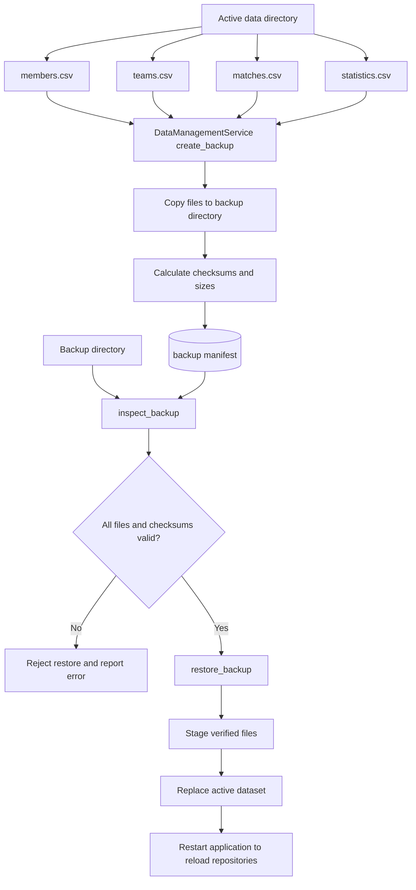

# Backup and Restore Data Flow

This view shows how the modern application protects the complete persistent dataset.

## Interpretation

The dataset is treated as one operational unit. Restore is gated by manifest and checksum validation so an incomplete or modified backup is rejected before active files are replaced.