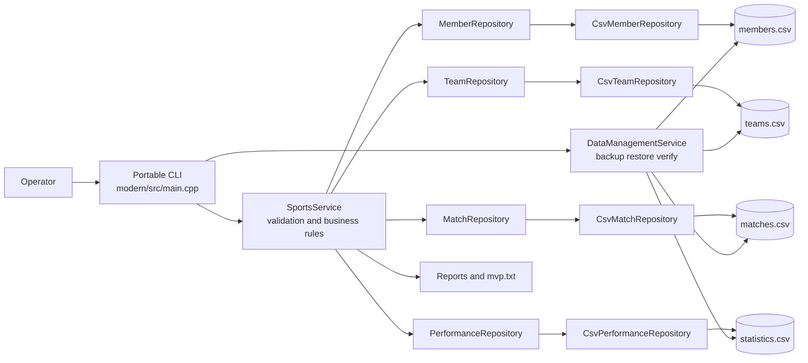

# Component Architecture

This view identifies the runtime boundaries of the portable modernization.

## Interpretation

The CLI is an input/output adapter, not the owner of business rules. Mutations pass through `SportsService`; persistence is hidden behind repository interfaces. `DataManagementService` operates on the complete four-file dataset for checksum-verified backup and restore.