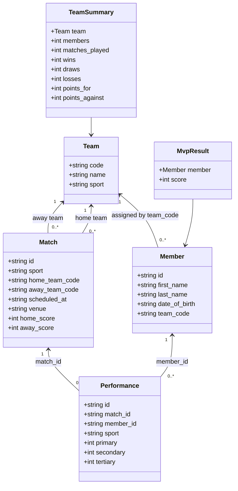

# Domain Model

This view shows the core modern C++20 domain records and their business relationships. Repository interfaces store the records; `SportsService` enforces cross-record rules.

## Interpretation

The model deliberately uses identifiers rather than owning object graphs. That keeps CSV serialization simple and makes referential validation explicit in the service layer. A performance is valid only when its member and match exist, its sport matches the match, and the member's team participated in that match.