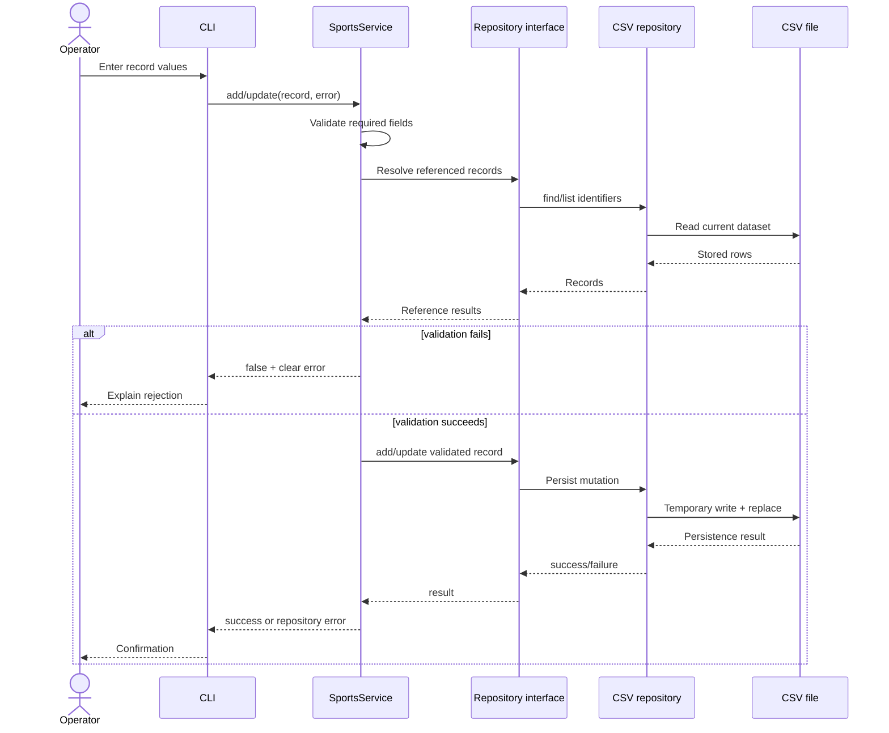

# Validated Mutation Sequence

This sequence represents add and update operations for teams, members, matches, and performances.

## Interpretation

Validation occurs before persistence. Rejected operations do not mutate stored data. CSV-backed repositories use a temporary-write-and-replace strategy to reduce the risk of partial writes.