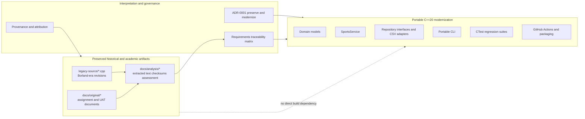

# Legacy Preservation and Modernization Boundary

The repository intentionally separates historical evidence from current, buildable software.

## Interpretation

The modernization does not edit, compile, or silently replace the preserved source revisions. Historical files remain evidence of the original coursework. Requirements and UAT findings are interpreted through analysis, provenance, ADRs, and the traceability matrix before they influence the independent C++20 implementation.